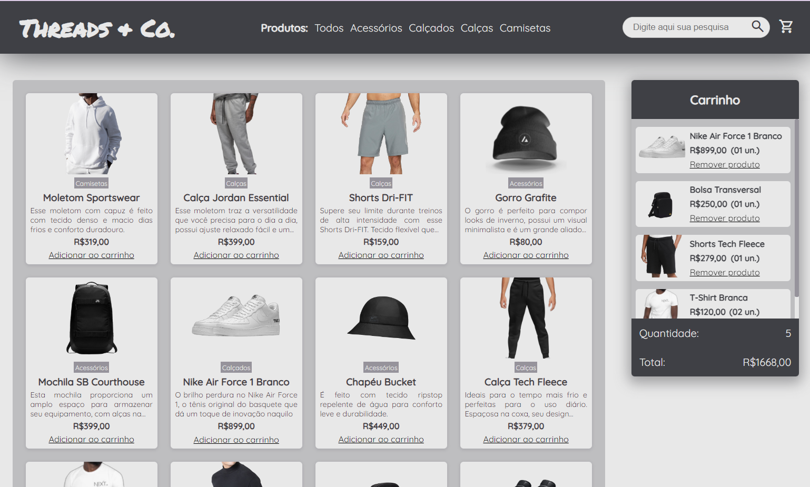

# Projeto Final Módulo 1 - Ecommerce Page

#
## Objetivo do Projeto
O objetivo deste projeto foi a elaboração do layout de uma página de e-commerce. Foram utilizados todos os recursos aprendidos no módulo 1 do bootcamp da Kenzie Academy: HTML, tags semânticas, propriedades em CSS e, para a inteligência da página foi utilizado o DOM, onde todos os cards foram criados de forma dinâmica, ou seja, renderizados na vitrine e carrinho através do DOM, além do uso de Event Listeners para configuração de botões de compra - adição e remoção dos produtos - de maneira funcional.

## English version
The objective of this project was the elaboration of the layout of an e-commerce page. All the resources learned in module 1 of the Kenzie Academy bootcamp were used: HTML, semantic tags, CSS properties and, for page intelligence, the DOM was used, where all the cards were created dynamically, that is, rendered in the showcase and shopping cart through DOM, in addition to the use of Event Listeners to configure purchase buttons - adding and removing products - in a functional way.

#
### Materiais e recursos utilizados:
- Fonts and icons extracted from Google Fonts.

- Product images sources: https://www.nike.com.br/

- Image by rawpixel.com: https://www.freepik.com/free-psd/men-with-turtleneck-sweater-mockup-with-gray-trousers_14323620.htm https://www.freepik.com/free-psd/simple-white-hoodie-mockup-psd-comfortably-sporty-menswear_14323283.htm
